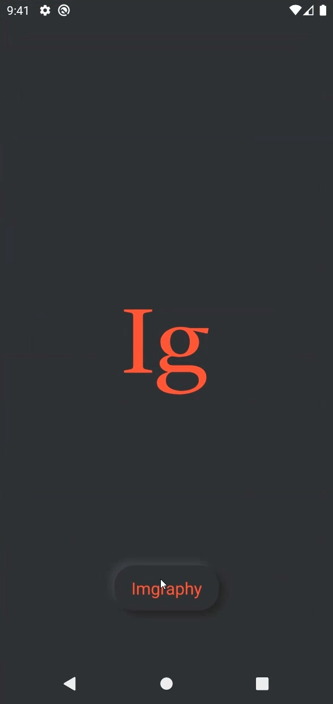
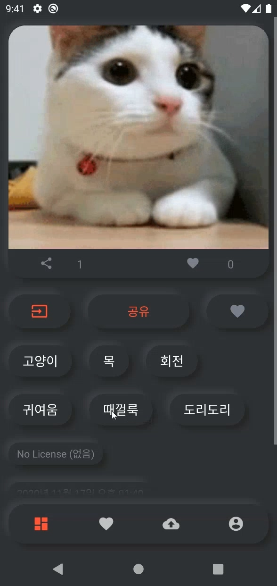
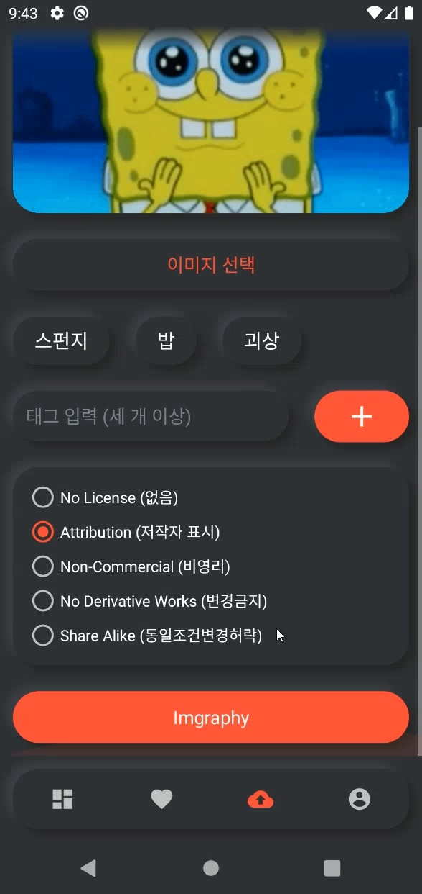

# imgraphy-android
### 태그 기반 이미지 공유 서비스 (안드로이드 클라이언트)

 

  
 

 

----------------------------------------

### Summary
[Google Drive](https://drive.google.com/drive/folders/1qOdxZFwjZg6GdsnIgLs3pM4jC8TnOTP1?usp=sharing)

### Library
- https://github.com/square/retrofit
- https://github.com/fornewid/neumorphism
- https://github.com/bumptech/glide
- https://github.com/google/gson

-----------------------------------------------
